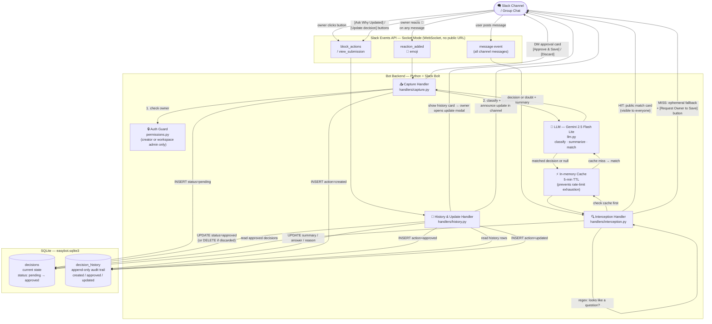
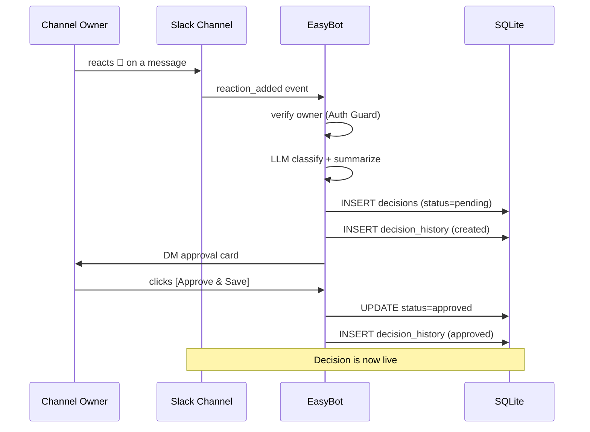
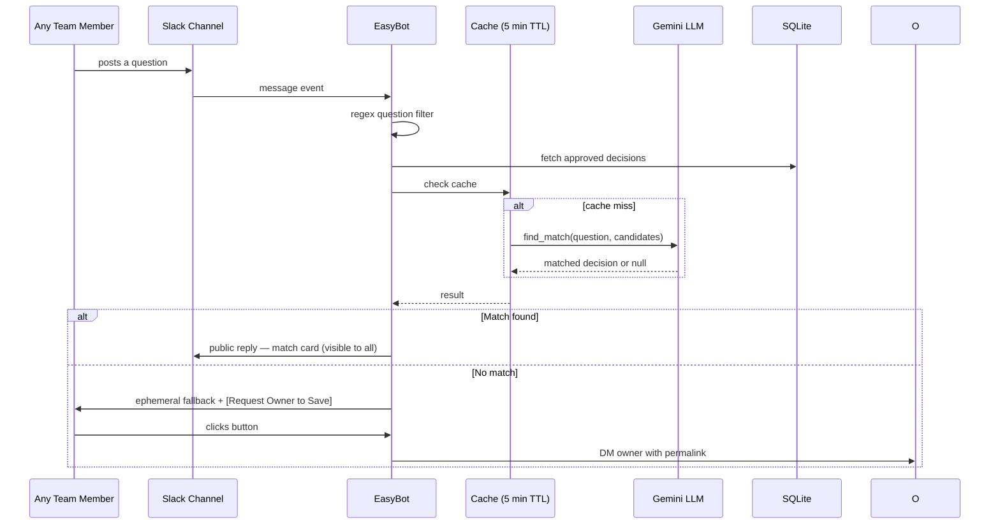

# EasyBot — Architecture

```mermaid
flowchart TD
    SC(["🗨️ Slack Channel\n/ Group Chat"])

    subgraph API["Slack Events API — Socket Mode (WebSocket, no public URL)"]
        EV1["reaction_added\n🧠 emoji"]
        EV2["message event\n(all channel messages)"]
        EV3["block_actions\n/ view_submission"]
    end

    subgraph BOT["Bot Backend — Python + Slack Bolt"]
        direction TB
        CAP["📥 Capture Handler\nhandlers/capture.py"]
        INT["🔍 Interception Handler\nhandlers/interception.py"]
        HIS["📜 History & Update Handler\nhandlers/history.py"]
        PERM["🔒 Auth Guard\npermissions.py\n(creator or workspace admin only)"]
        LLM["🤖 LLM — Gemini 2.5 Flash Lite\nllm.py\nclassify · summarize · match"]
        CACHE["⚡ In-memory Cache\n5-min TTL\n(prevents rate-limit exhaustion)"]
    end

    subgraph DB["SQLite — easybot.sqlite3"]
        DEC[("decisions\ncurrent state\nstatus: pending → approved")]
        AUD[("decision_history\nappend-only audit trail\ncreated / approved / updated")]
    end

    %% ── Workflow 1: Capture ──────────────────────────────────────────
    SC -->|"owner reacts 🧠\non any message"| EV1
    EV1 --> CAP
    CAP -->|"1. check owner"| PERM
    CAP -->|"2. classify + summarize"| LLM
    LLM -->|"decision or doubt + summary"| CAP
    CAP -->|"INSERT status=pending"| DEC
    CAP -->|"INSERT action=created"| AUD
    CAP -->|"DM approval card\n[Approve & Save] / [Discard]"| SC

    %% ── Workflow 1b: Approval ────────────────────────────────────────
    SC -->|"owner clicks button"| EV3
    EV3 --> HIS
    HIS -->|"UPDATE status=approved\n(or DELETE if discarded)"| DEC
    HIS -->|"INSERT action=approved"| AUD

    %% ── Workflow 2: Interception ─────────────────────────────────────
    SC -->|"user posts message"| EV2
    EV2 --> INT
    INT -->|"regex: looks like a question?"| INT
    INT -->|"read approved decisions"| DEC
    INT -->|"check cache first"| CACHE
    CACHE -->|"cache miss → match"| LLM
    LLM -->|"matched decision or null"| CACHE
    CACHE --> INT
    INT -->|"HIT: public match card\n(visible to everyone)"| SC
    INT -->|"MISS: ephemeral fallback\n+ [Request Owner to Save] button"| SC

    %% ── Workflow 3: History & Update ─────────────────────────────────
    SC -->|"[Ask Why Updated] /\n[Update decision] buttons"| EV3
    HIS -->|"read history rows"| AUD
    HIS -->|"show history card → owner opens update modal"| SC
    HIS -->|"UPDATE summary / answer / reason"| DEC
    HIS -->|"INSERT action=updated"| AUD
    HIS -->|"announce update in channel"| SC
```

## Decision lifecycle

```mermaid
sequenceDiagram
    participant O as Channel Owner
    participant S as Slack Channel
    participant B as EasyBot
    participant DB as SQLite

    O->>S: reacts 🧠 on a message
    S->>B: reaction_added event
    B->>B: verify owner (Auth Guard)
    B->>B: LLM classify + summarize
    B->>DB: INSERT decisions (status=pending)
    B->>DB: INSERT decision_history (created)
    B->>O: DM approval card

    O->>B: clicks [Approve & Save]
    B->>DB: UPDATE status=approved
    B->>DB: INSERT decision_history (approved)

    Note over S,DB: Decision is now live
```

## Query intercept flow

```mermaid
sequenceDiagram
    participant U as Any Team Member
    participant S as Slack Channel
    participant B as EasyBot
    participant C as Cache (5 min TTL)
    participant L as Gemini LLM
    participant DB as SQLite

    U->>S: posts a question
    S->>B: message event
    B->>B: regex question filter
    B->>DB: fetch approved decisions
    B->>C: check cache
    alt cache miss
        C->>L: find_match(question, candidates)
        L-->>C: matched decision or null
    end
    C-->>B: result

    alt Match found
        B->>S: public reply — match card (visible to all)
    else No match
        B->>U: ephemeral fallback + [Request Owner to Save]
        U->>B: clicks button
        B->>O: DM owner with permalink
    end
```
